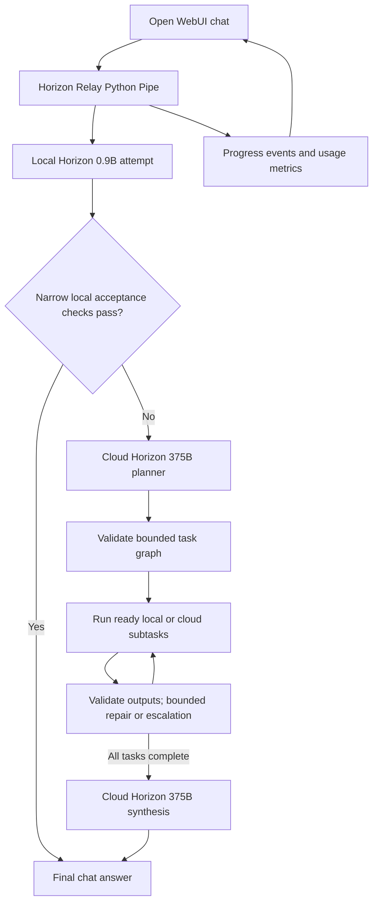

# Horizon Relay: implemented prototype

Last documented: September 19, 2026. This describes the implementation on
`feature/relay-prototype`, including the real-model integration in commit
`3260165`. It is a record of current behavior; the [integration plan](INTEGRATION_PLAN.md)
also contains future work and earlier design proposals.

## What works today

Horizon Relay runs inside Open WebUI and combines an actual local Horizon 0.9B
model with the IFM Horizon 375B API. It attempts a request locally, escalates
requests that need planning, delegates easier plan steps back to local workers,
and asks the large model to synthesize the results. A separately labeled
simulation remains available for repeatable demonstrations and tests.

The prototype has been built and run with Docker on the development Mac. The
chat interface is available at `http://localhost:3000` while the containers run.
The real Pipe is installed and active in that local instance. This is a local
prototype, not a public hosted deployment.

## Architecture



The relay engine is a Python library in the Open WebUI backend. There is no
separate relay API microservice. Local inference runs in a second container;
the large model runs at IFM's external API.

## Open WebUI integration

- Vendored Open WebUI **v0.11.3** without modifying its frontend source.
  [SOURCE.json](SOURCE.json) records the release archive, checksum, upstream
  commit, and verification of 5,060 upstream regular files. Upstream Git history
  was not imported. Original licenses and notices remain in place.
- Implemented the [Horizon Relay Pipe](integrations/openwebui/horizon_relay_pipe.py),
  version 0.2.0, using the existing chat, model picker, and status-event UI.
- Live configuration exposes **Horizon Relay** (`horizon_relay.live`) and
  **Horizon Relay (Simulated Demo)** (`horizon_relay.demo`). Selecting the demo
  explicitly uses simulation even when the live provider is enabled.
- The local instance defaults to the live model and includes example prompts.
- Text conversations preserve system, user, and assistant messages. Attachments,
  multimodal content, and unsupported tool/role messages are rejected.
- Title, tag, and other background requests bypass the full relay: live mode
  uses a single local completion; simulation uses lightweight scripted output.
  These calls are separate from the visible turn's metrics.
- Progress arrives during execution. Final text returns through the normal
  Pipe completion path, including requests without an event emitter.
  Model tokens do not stream individually yet.
- Saved chats retain progress events after reload. A serialized event callback
  prevents concurrent status updates from overwriting one another.

## Actual models and inference

| Role | Model | Runtime |
| --- | --- | --- |
| Routing and local workers | `IFM/K2-Horizon-0.9B` | Compatible llama.cpp server in Docker, CPU inference |
| Planning, escalated work, synthesis | `IFM/K2-Horizon-375B-A23B` | IFM Chat Completions API at `https://api.ifm.ai/v1` |

Local weights originate from the official
[IFM/K2-Horizon-0.9B-GGUF repository](https://huggingface.co/IFM/K2-Horizon-0.9B-GGUF),
revision `c9e2c6d99a9c682cdc2c4f439c480c07a6ded35c`. The source filename is
`K2-Horizon-1B-BF16.gguf`, despite the repository's 0.9B designation.

Docker Model Runner downloaded the source weights, but its bundled llama.cpp
b9879 rejected the `k2-horizon` architecture. The working inference image builds
[IFM's compatible llama.cpp fork](https://github.com/MBZUAI-IFM/llama.cpp/tree/model/K2Horizon)
at commit `42adf019f76013dac873b5b43950d54d5ab27216`.

The active weights were converted from BF16 to **Q4_K_M** with that fork's
`llama-quantize`. Tensor size decreased from 2,056.83 MiB to 632.77 MiB. The
quantized file is mounted read-only and is not committed to Git. This deployment
uses Linux ARM64 CPU inference, not native Metal acceleration. The server uses
an 8,192-token context, one inference slot, and four threads.

The async HTTP adapter supports Chat Completions responses, records returned
usage, and removes K2's inline reasoning prefix or `<think>` content before
parsing structured output or returning visible text. HTTP redirects and hidden
HTTP retries are disabled. Empty or truncated completions are treated as errors.

## Routing, planning, and delegation

### Local acceptance

Routing is deliberately conservative. Simple greetings may finish locally when
the returned answer passes the narrow checks. `/local-extract TEXT` uses a
focused extraction prompt and accepts only an exact match to the supplied text.
Other ordinary requests escalate to cloud planning; a small model's reported
confidence alone does not qualify them for local-only execution.

This is an implemented rule-based policy, not a trained or calibrated router.

### Validated plans

The cloud planner is prompted to produce two to four subtasks, including at
least two local assignments. The engine enforces a maximum of six tasks and
validates a versioned directed acyclic graph before running it.

A plan has `version`, `tasks`, and `final_instruction`. Each task has `id`,
`instruction`, `preferred_tier`, `input_refs`, `depends_on`, `result_type`, and
`checks`. Inputs refer to named sources or declared predecessor results.

Validation rejects unknown fields, duplicate or invalid IDs, missing sources,
unknown dependencies, undeclared result dependencies, cycles, unsupported
result types/checks, and plans exceeding the task bound. Plans cannot introduce
arbitrary execution endpoints or executable code.

### Execution and output validation

The scheduler runs ready tasks in bounded batches, retaining accepted results
for later dependencies. Local concurrency defaults to one and supports at most
two workers. Independent successful results remain recorded if another task
fails; dependent tasks do not run with missing results.

Supported output contracts:

| Result type | Checks |
| --- | --- |
| `task_answer` | Required structured fields and a nonempty bounded answer |
| `report_extraction` | Required fields and verbatim quote presence in assigned sources |
| `report_groups` | Required fields and each assigned report ID preserved exactly once |

Real general-purpose work uses `task_answer`. Its checks validate structure,
not factual correctness. Quote presence likewise does not establish semantic
entailment. Cloud synthesis reviews the worker results and produces the final
answer; correctness is not guaranteed by the validation layer.

A malformed plan gets at most one cloud repair. Invalid local worker output can
receive one local repair, then one cloud attempt subject to the shared budgets.
There is no recursive spawning of agents. Transport failures end the run with a
sanitized error rather than silently spending more calls.

## Bounds and failure handling

| Bound | Implemented value |
| --- | --- |
| Tasks per plan | At most 6 |
| Local worker concurrency | Default 1; maximum 2 |
| Cloud attempts per run | At most 5 |
| Cloud worker attempts across the run | At most 2 |
| Cloud planning attempts | Initial attempt plus at most 1 repair |
| Local attempts per worker | Initial attempt plus at most 1 repair |
| Live call timeout / overall deadline | 120 seconds / 480 seconds |
| Core default timeout / deadline | 30 seconds / 180 seconds |
| Goal size | 8,000 characters |
| Live conversation size | 24,000 characters |
| Engine sources | At most 6; 32,000 total characters |
| Provider output token limit | 4,096 for planning; 2,048 for other stages |

Cloud attempts count even when they fail or time out. Scheduling reserves a
cloud call for synthesis before spending the remaining budget on nonfinal work.
Each run owns its state and budget. Oversized conversations are rejected rather
than silently truncated.

Cancellation cancels and awaits child tasks, closes async HTTP contexts, and
propagates cancellation. Progress-delivery failures are logged without repeating
provider calls. Errors avoid returning API credentials or raw provider error
bodies. There is no durable execution resume after a process restart.

## Progress and measurements

Each run has an ID and monotonically ordered event sequence. Events include
plan creation, task transitions, retries, escalation, failures, completion, and
terminal metrics. The plan event carries a task-graph snapshot, but there is no
custom graphical task viewer yet.

Metrics include local/cloud call counts, completed task IDs, elapsed time, and
per-call model, stage, task, duration, outcome, prompt tokens, and completion
tokens. Live token counts come from provider usage fields; missing counts stay
unavailable rather than becoming zero. The final usage footer reports totals
only when the needed usage is available. No dollar-pricing model or demonstrated
cost-savings benchmark is implemented.

## Deterministic simulation

The simulated provider uses two built-in bug reports and scripted responses.
It makes no inference/API calls and visibly labels its output as simulated.
Unsupported arbitrary prompts receive demo instructions.

| Command in the simulated model | Behavior | Simulated local/cloud calls |
| --- | --- | --- |
| `/relay-demo` | Plan, local extraction/grouping, synthesis | 4 / 2 |
| `/relay-demo local` | Local-only response | 1 / 0 |
| `/relay-demo repair` | Inject one invalid quote, then local repair | 5 / 2 |
| `/relay-demo escalate` | Inject two invalid local quotes, then cloud subtask | 5 / 3 |

The same engine drives live and simulated execution. The CLI also exposes
scenario selection, optional delay, JSONL progress events, and disabled-cloud
behavior:

```sh
PYTHONPATH=relay/src python3 -m horizon_relay --scenario escalate --events
```

## Docker and configuration

- [Dockerfile.relay](deployment/Dockerfile.relay) extends the official Open WebUI
  v0.11.3 image with the relay package and Pipe source.
- [Dockerfile.local-model](deployment/Dockerfile.local-model) builds the pinned
  compatible inference server and quantizer in a multistage image.
- [Base Compose configuration](deployment/compose.relay.yaml) provides the UI,
  persistent data volume, localhost port binding, and runtime configuration.
- [Live Compose overlay](deployment/compose.live.yaml) adds local inference and
  configures the live provider. Its inference port is internal to Docker.
- Compose project `horizon-relay` uses restart-unless-stopped services and a
  persistent `horizon-relay_relay-webui-data` volume.
- The active local instance uses a fresh single-user, auth-disabled setup bound
  to loopback. This is not a production authentication configuration.
- Private `.env` contains runtime credentials and machine-specific model paths.
  It is Git-ignored and excluded from the Docker build context; `.env.example`
  contains placeholders. The cloud key is sent only by the backend cloud adapter.
- Open WebUI's offline setting disables its own downloads/integrations; it does
  **not** disable the relay adapter's explicitly configured IFM API calls.
- Copying the Pipe into the image does not register/update its Function in the
  Open WebUI database. The active instance has been updated; new installations
  must perform that import/update step.

With private configuration and the local model file prepared, start from the
repository root:

```sh
docker compose --env-file .env \
  -f deployment/compose.relay.yaml \
  -f deployment/compose.live.yaml \
  -p horizon-relay up --build -d
```

See [container instructions](deployment/README.md) and
[live model setup](deployment/LIVE_MODELS.md) for prerequisites and setup details.

## Verification completed

The latest implementation verification passed **37 automated tests**: 29 core
and Pipe tests plus 8 live-adapter tests. Coverage includes graph validation,
budget reservation/exhaustion, retry/escalation, dependency failure, retained
sibling results, concurrency, timeout/cancellation, isolated runs, event delivery
and persistence ordering, demo labeling, attachment rejection, background-task
bypass, credential routing, sanitized failures, malformed/truncated output,
K2 reasoning removal, focused extraction, and a mock-HTTP full relay flow.

Run the suite with the live dependency installed:

```sh
python3 -m pip install -e './relay[live]'
python3 -m unittest discover -s relay/tests -v
```

HTTP unit tests use mock transports and do not incur API costs. Separate real
smoke checks on September 19, 2026 verified:

- Authenticated access to the configured IFM 375B endpoint.
- Local exact extraction in about **1.5 seconds**, using one local call, no cloud
  calls, and 104 reported tokens.
- A real browser conversation comparing SQLite and PostgreSQL for a campus
  lost-and-found app: about **38 seconds**, four local calls (routing plus three
  subtasks), two cloud calls (planning and synthesis), and **3,954 reported
  tokens**. The subtasks extracted requirements, compared databases, and drafted
  a recommendation; the final answer recommended SQLite and implementation steps.
- All 12 status events from that live run persisted in sequence in saved history.
- The simulated escalation flow retained all 18 events after the event
  serialization fix, and saved chat content survived browser reload.

These are individual smoke-test observations, not evidence of general latency,
quality, or cost improvements over an all-cloud baseline. Browser Stop,
multi-user isolation, and temporary-chat behavior still need dedicated browser
acceptance checks; unit-level cancellation coverage is already present.

## Source map

| Path | Responsibility |
| --- | --- |
| `relay/src/horizon_relay/engine.py` | Scheduling, budgets, repair, cancellation, events, metrics |
| `relay/src/horizon_relay/schemas.py` | Plan/task/result types and graph validation |
| `relay/src/horizon_relay/validators.py` | Worker output checks |
| `relay/src/horizon_relay/providers.py` | Provider interface and deterministic simulation |
| `relay/src/horizon_relay/live.py` | Real HTTP providers, prompts, reasoning cleanup, usage |
| `relay/src/horizon_relay/chat.py` | Conversation normalization, live routing and background calls |
| `relay/src/horizon_relay/config.py` | Engine limits |
| `relay/src/horizon_relay/__main__.py` | Simulation CLI |
| `relay/src/horizon_relay/fixtures/bug_reports.json` | Built-in demo inputs |
| `relay/tests/` | Core, Pipe, and live adapter tests |
| `integrations/openwebui/horizon_relay_pipe.py` | Open WebUI adapter |
| `deployment/` | Docker build/runtime definitions and setup documentation |
| `open-webui/` | Unmodified upstream UI/backend source |

The Python package is `horizon-relay` version 0.2.0 and requires Python 3.11+.
The core/simulator is dependency-free; the `live` extra adds HTTPX.

## Remaining work

- Calibrated routing that can safely accept more general requests locally.
- Additional small-model tiers and measured model-selection tradeoffs.
- A custom task-graph UI and token-by-token model streaming.
- Broader quality evaluation and an all-cloud cost/latency baseline.
- Dedicated browser Stop, multi-user, and temporary-chat acceptance tests.
- Attachment parsing, retrieval, multimodal input, browsing, code execution,
  and other external tools, if selected for the project scope.
- Durable job recovery and production deployment/authentication hardening.

The existing implementation supports bounded planning and delegation today;
these remaining features are not implied by the current demo or smoke checks.
