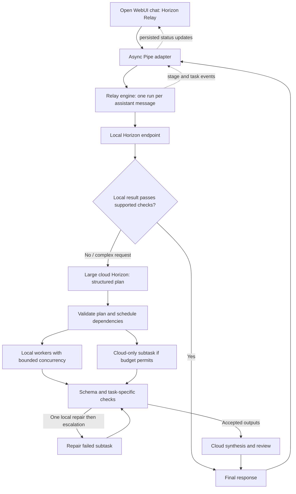

# Horizon Relay × Open WebUI

## Decision

Expose **Horizon Relay** as an Open WebUI Pipe model. Implement the orchestration in a separate, testable Python package loaded by that Pipe. Use Open WebUI's existing chat, model picker, streaming, cancellation, and saved status history for the first working version. Then add a small Svelte task-graph component to show delegation visually.

The product behavior remains: try locally → escalate the reasoning to the large cloud model → delegate bounded subtasks back to the local model → validate and repair → assemble the response.

Implementation status: the first prototype now includes the async Pipe, simulated provider, dependency-aware engine, validation, budgets, cancellation, CLI scenarios, and direct engine/Pipe tests. Real models and the custom graph are deferred. Docker startup and browser acceptance remain unverified; see `deployment/README.md`. The sections below remain the broader roadmap.

## Source baseline

- Repository: <https://github.com/open-webui/open-webui>
- Release: **v0.11.3**, returned by GitHub's latest-release endpoint on September 19, 2026.
- Commit: `2a960a59fe1dbbd35282f0556b3666d81102e781`.
- Local source: `open-webui/`, beside this document.
- Provenance and archive SHA-256: `SOURCE.json`.
- Format: complete release source archive, without `.git` history. System Git currently fails because the Xcode license has not been accepted. The archive is a usable source baseline; it is not a Git clone or a remote fork.
- All downloaded upstream files, including license notices, are preserved unchanged. Keep Open WebUI branding and add Horizon Relay as a model/product feature.

## Architecture



Start with **one local model plus the largest cloud model**. Multiple small-model tiers are a later routing improvement. Worker assignments are a calibrated capability policy, not a claim that a particular model size can reliably perform every task in a category.

The engine is a Python library in the Open WebUI backend process for the MVP. This keeps async cancellation and event emission straightforward. A separate HTTP relay service and OpenAI-compatible endpoint can be added later if other clients need access; they are not required to ship this demo.

## Integration points verified in this release

Paths below are relative to `open-webui/`. Line numbers refer to the pinned source.

| Existing file | Relevant behavior | Planned use |
| --- | --- | --- |
| `backend/open_webui/functions.py:71` | Registers active Pipe Functions as models, including manifold submodels. | Register one model named Horizon Relay. |
| `backend/open_webui/functions.py:153` | Invokes the Pipe and supports async responses and streaming. | Thin async adapter that returns final content through the normal completion path. |
| `backend/open_webui/functions.py:225` | Extracts metadata and injects declared parameters such as `__event_emitter__`, `__task__`, and `__user__`. | Identify turns, emit progress, and bypass orchestration for background tasks. |
| `backend/open_webui/utils/chat.py:282` | Dispatches Pipe models to the Function completion handler. | Existing dispatch; no new chat endpoint needed. |
| `backend/open_webui/socket/main.py:1089` | Saves `status` events for saved chat messages. | Persist bounded relay events inside status data. |
| `backend/open_webui/models/chats.py:1241` | Appends status data to the message's `statusHistory`. | Reconstruct the demo trace after a reload. |
| `src/lib/components/chat/Chat.svelte:1213` | Appends incoming status events to frontend message history. | Existing live transport; no new socket event type in the MVP. |
| `src/lib/components/chat/Messages/ResponseMessage/StatusHistory.svelte` | Renders expandable progress history. | Immediate visibility without a frontend patch. |
| `src/lib/components/chat/Messages/ResponseMessage.svelte:75` | Declares the message status type; renders status history later in the file. | Later extend the type and render a RelayTrace component. |
| `backend/open_webui/routers/tasks.py` | Generates titles, tags, follow-ups, and similar background requests. | Configure a direct local task model; also guard the Pipe using `__task__`. |
| `backend/open_webui/tasks.py` and `src/lib/components/chat/Chat.svelte:3729` | Backend task cancellation and the chat Stop action. | Test propagation into the engine and every pending worker. |

The Pipe may receive no event emitter on plain API calls. Final responses must still work. Return or yield answer content through the Pipe; do not rely exclusively on socket `message` events to save the final answer.

## Proposed additions

Create these beside the downloaded source, keeping the relay package independent of upstream internals:

```text
IFM_Hackathon/
  open-webui/                         # downloaded upstream baseline
  relay/
    pyproject.toml
    src/horizon_relay/
      config.py                      # endpoint registry and hard limits
      schemas.py                     # plans, results, events, budget state
      providers.py                   # async local/cloud clients + fake provider
      routing.py                     # local attempt and acceptance policy
      planner.py                     # structured planning and one repair attempt
      scheduler.py                   # dependency ordering and worker limits
      validators.py                  # executable, allowlisted result checks
      engine.py                      # complete lifecycle and cancellation
      telemetry.py                   # measured calls, tokens, latency, events
    tests/
    examples/bug_reports.json
  integrations/openwebui/horizon_relay_pipe.py
  deployment/Dockerfile.relay
  deployment/compose.relay.yaml
  .env.example
```

For the optional graph, modify `ResponseMessage.svelte` and add `ResponseMessage/RelayTrace.svelte` plus a small event reducer/type file. Render the graph from the relay payload in `statusHistory`; reuse the already-listed `@xyflow/svelte` dependency if a full DAG view is useful. A simple task list is sufficient initially.

## Request and task contracts

**Request context:** a new run ID, authenticated user ID, chat/message IDs where present, conversation text, validated policy, and per-run budget. Keep state per request; the cached Pipe instance must never hold a shared mutable run or transcript.

**Local attempt:** return a structured candidate result or `needs_plan` with a short reason. Initially accept local-only completion for narrow operations we can check, such as exact field/quote extraction from supplied text. Arbitrary prose is not proven correct by valid JSON or a confidence score; route unsupported or ambiguous requests to planning.

**Cloud plan:** a typed, finite task graph. Example shape:

```json
{
  "version": 1,
  "tasks": [
    {
      "id": "extract_report_1",
      "instruction": "Extract symptoms and reproduction steps from report 1.",
      "preferred_tier": "local",
      "input_refs": ["sources.report_1"],
      "depends_on": [],
      "result_type": "report_extraction",
      "checks": ["required_fields", "source_quotes_match"]
    },
    {
      "id": "group_reports",
      "instruction": "Group reports by symptom; preserve every report ID.",
      "preferred_tier": "local",
      "input_refs": ["results.extract_report_1"],
      "depends_on": ["extract_report_1"],
      "result_type": "report_groups",
      "checks": ["required_fields", "report_ids_preserved"]
    }
  ],
  "final_instruction": "Use the accepted results to propose a prioritized engineering plan."
}
```

The planner selects from application-defined result types and checks. The application supplies their actual schemas and validation functions. Reject unknown check names, duplicate IDs, unknown sources, undeclared result dependencies, cycles, oversized plans, and unknown tiers before executing workers. Model output cannot supply an endpoint URL, code to execute, a secret, or a new validation function. `preferred_tier` is a suggestion checked against the configured capability policy and remaining budget.

**Worker input:** subtask instruction, resolved source text, relevant accepted dependency outputs, expected schema, and check descriptions. Preserve necessary constraints from the conversation. Do not send the entire conversation to every worker by default; never silently omit required dependencies to fit context.

**Worker result:** task ID, structured output, source references/quotes when applicable, and an explicit error/needs-help outcome. Code records the actual model, attempt, elapsed time, usage, and validation findings. A matching quote proves source presence, not that a conclusion follows from it. Use cloud semantic review for ambiguous relations and final synthesis; label that as model review, not deterministic proof.

**Progress event:** use the existing status envelope with an optional namespaced payload:

```json
{
  "type": "status",
  "data": {
    "action": "horizon_relay",
    "description": "Local worker completed 2 of 4 subtasks",
    "done": false,
    "relay": {
      "version": 1,
      "run_id": "generated-run-id",
      "seq": 7,
      "event": "task_completed",
      "task_id": "extract_report_1",
      "tier": "local",
      "attempt": 1,
      "elapsed_ms": 842
    }
  }
}
```

Emit bounded stage/task transitions, not every token or hidden model reasoning. Include a validated task-graph snapshot on `plan_created` and a metrics summary on the terminal event. Use monotonically increasing sequence numbers to deduplicate replayed events. Saved chat history can restore the display; it does not imply an interrupted run can resume after a server restart. Temporary chats do not provide durable traces.

## Execution policy

1. Normalize text chat messages and retain the user's goal and conversation constraints. Scope the first demo to text; explicitly reject unsupported image/audio inputs and defer uploads/RAG until we have a deliberate source-extraction adapter.
2. Attempt locally. Check supported result types; otherwise record an escalation reason and ask the large model for a plan.
3. Parse and validate the plan. Permit one cloud plan-repair call with concrete validation errors. A second invalid plan ends the run with an actionable error.
4. Execute only ready tasks. Default local concurrency to **1**, adjustable to **2** after measuring the host. Multiple simultaneous generations on one local model can make latency worse.
5. Validate outputs. Permit one local repair per local task with the failed checks. Then escalate that subtask if the run's cloud budget allows it. An initially cloud-assigned task uses the same escalation-call pool and does not get unlimited retries.
6. Do not run dependents of a failed task or present partial results as complete. Preserve accepted results and report the unresolved task if budget, timeout, or validation prevents completion.
7. Use the cloud model once to assemble and review the accepted subtask results, unresolved uncertainties, and relevant original constraints. Stream the user-facing final response. Local-only accepted tasks skip this cloud stage.
8. Finalize usage and status on success, failure, timeout, and cancellation. On Stop, cancel and await child tasks, close active HTTP streams, and re-raise cancellation. An already-sent provider request may still incur provider charges; no new call may begin afterward.

Suggested starting limits: 6 tasks, 2 attempts per local task, 1 plan repair, at most 2 cloud worker calls shared across all tasks, and **5 total cloud attempts** (plan + optional plan repair + up to 2 worker calls + synthesis). Reserve the synthesis call before scheduling cloud workers. Count attempted calls even when they time out; all transport retries consume limits. Add configurable per-call token caps, a 180-second overall deadline, and per-stage timeouts. Tune these against actual local throughput before the demo.

## Endpoint configuration and deployment

Use async HTTP clients behind one provider interface. Start with configurable Chat Completions-compatible endpoints; the actual hackathon cloud API format still needs to be checked. Do not hardcode a guessed cloud host or model ID. Probe required capabilities with a tiny request before a real run; gracefully handle endpoints that do not support JSON-schema mode or report token usage.

Configuration: `LOCAL_BASE_URL`, `LOCAL_MODEL`, optional local key, `CLOUD_BASE_URL`, `CLOUD_MODEL`, cloud key, `CLOUD_ENABLED`, limits, and a fake/real provider switch. Credentials stay in backend environment/secrets. Pipe Valves can expose non-secret defaults; user settings may lower limits but not override server policy or select arbitrary destinations.

The Pipe calls the local/cloud provider adapters directly; it must not call its own Horizon Relay model ID through Open WebUI and recurse. Restrict the Relay model to the intended demo users. Disable unrelated global filters/tools for the controlled demo, and configure Open WebUI's background task models to a direct local model. The Pipe also routes non-null `__task__` requests through a single bounded local completion instead of running a relay.

Offer a cloud-disabled mode that fails clearly when a request needs the planner. Once cloud escalation is enabled, planner/synthesis context goes to the cloud; delegation back to local workers does not make that run wholly local.

Package the library into a derived Open WebUI image, first based on `ghcr.io/open-webui/open-webui:v0.11.3`, and import/enable the reviewed Pipe through the admin Functions interface. Before adding frontend changes, build an image from the downloaded source using its Dockerfile and install the same relay package in a derived layer. The relay package must be available in the backend Python environment before loading the Pipe.

Use a dedicated Compose file and persistent Open WebUI data volume, bind the demo UI to `127.0.0.1:3000`, and keep a fixed `WEBUI_SECRET_KEY`. On macOS with a host-native local model, use `host.docker.internal` from the container; with a containerized model server use its Compose service name. Do not assume the upstream bundled Ollama Compose configuration is the right local runtime for this machine.

Environment observed during planning: Python **3.13.0** is available; `docker`, `node`, `npm`, and `uv` are absent from the current shell PATH. Upstream specifies Python **3.11–3.12** and Node **18.13–22**; its Dockerfile uses Python 3.11 and Node 22. Prefer Docker for the first launch, or provision compatible local runtimes. No dependency installation or launch has been attempted.

## Implementation sequence and acceptance gates

| Milestone | Deliverable | Complete when |
| --- | --- | --- |
| 1. UI connection | Fake provider, minimal async Pipe, model registration, status events, final response. | Select Horizon Relay, send a message, see progress and one answer; reload a saved chat and retain both. API calls without an emitter also succeed. |
| 2. Delegation engine | Typed plans, validators, scheduler, call budgets, per-run state, cancellation. | A deterministic fixture produces a dependency graph, runs local workers, repairs one failure, escalates only that task, and finishes within limits. A scripted trace is visibly labeled simulated. |
| 3. Real models | Local/cloud adapters, environment configuration, capability probes, local acceptance policy. | An easy extraction uses zero cloud calls; a complex fixture reaches cloud planning then executes at least two subtasks locally. Record actual model IDs. |
| 4. Reliability | Error handling, context bounds, background-task handling, regression tests. | Cycles and invalid plans are rejected; timeouts and 429s are bounded; Stop starts no further calls; no cross-user run state or cloud planning for titles. |
| 5. Demo trace | RelayTrace Svelte component plus final metrics. | Display task dependencies, assigned model, attempts, failures, and escalation live; saved trace survives reload; malformed trace fields cannot break ordinary chat. |
| 6. Evaluation | Fixed prompt set, all-cloud baseline, machine-readable results. | Compare answer quality, total latency, and cloud tokens including routing/planning/repairs/synthesis. Report regressions as well as wins. |

First implementation slice: milestone 1 plus the schemas and fake-provider lifecycle from milestone 2. Prove the entire UI → Pipe → local attempt → cloud plan → local workers → final response path with deterministic fixtures before spending tokens on real models.

## Demo and evaluation

Use a small set of supplied bug reports. An easy request extracts a named field locally. A complex request asks for a prioritized engineering plan; the large model decomposes it, local workers extract/group reports, and the large model reconciles priorities. A separate deliberately malformed worker result demonstrates validation and bounded escalation, clearly identified as an injected failure.

Record total end-to-end latency, time to first visible progress, time to first answer token, local and cloud calls, reported prompt/completion tokens by model, retries, and validation outcomes. Unknown usage stays unknown rather than becoming zero. Show dollar estimates only after provider prices are configured. Do not calculate savings from an invented all-cloud token count: run the same prompts through the cloud baseline, judge both with the same rubric, and distinguish cold-start from warmed local runs.

Unit tests should cover graph validation, dependency visibility, real budget exhaustion, failed-task blocking, and cancellation during an HTTP stream. Adapter tests should cover fragmented streams, malformed JSON, empty output, provider errors, and missing usage. Integration tests should cover saved versus temporary chats, streaming versus non-streaming, title-task bypass, regeneration/new run IDs, user isolation, and a browser Stop/reload cycle.

## Remaining inputs

- Cloud provider URL, model ID, request format, and optional pricing; configure the key privately in the environment.
- Local hardware/RAM and runtime already available, if any, to choose one practical quantized small Horizon model.
- Available hackathon time, to decide whether milestone 5's custom graph fits after the working relay.

These do not block the fake-provider integration or the engine tests.

## References

- [Pinned upstream release](https://github.com/open-webui/open-webui/releases/tag/v0.11.3)
- [Pipe Function interface](https://docs.openwebui.com/features/extensibility/plugin/functions/pipe/)
- [Plugin events](https://docs.openwebui.com/features/extensibility/plugin/development/events/)
- [Quick start and deployment options](https://docs.openwebui.com/getting-started/quick-start/)

The local v0.11.3 source is the implementation reference; live documentation may describe newer behavior.
